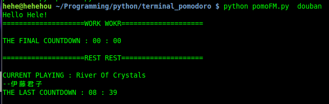

##番茄计时器+豆瓣FM
45分钟工作

10分钟休息--播放一首豆瓣FM或者本地MP3

##设置
需要设置music_dir, 如果使用豆瓣FM还要设置username, password

```
{
    "work_time": 45,
    "rest_time": 10,
    "music_dir": "/home/hehe/Music",
    "username": "xxxxx@xxx.xx",
    "password": "xxxxx",
    "channel" : 13
}

```

channel 13 是豆瓣FM的Jazz频道,其它频道参考[http://www.douban.com/j/app/radio/channels](http://www.douban.com/j/app/radio/channels)

##使用 
先安装mpg123
```
sudo apt-get install mpg123
```
使用
```python
#使用本地音乐
python pomoFM.py
#使用豆瓣FM
python pomoFM.py douban
```
<center></center>